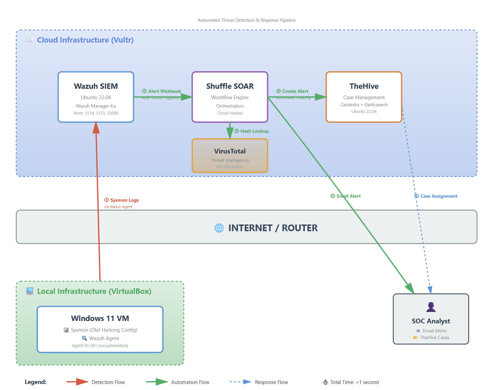
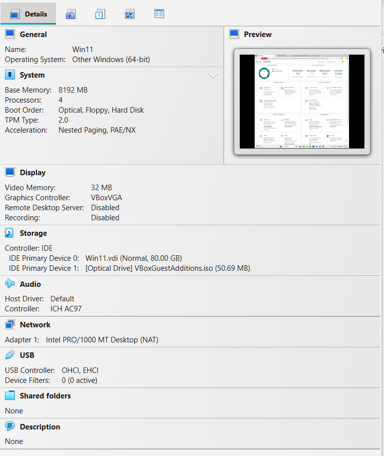
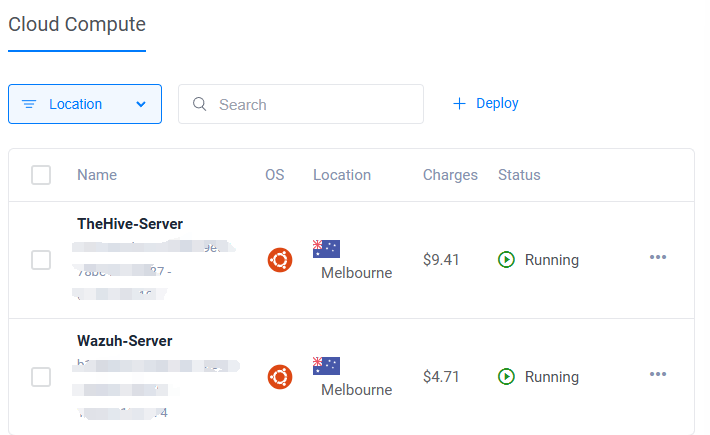
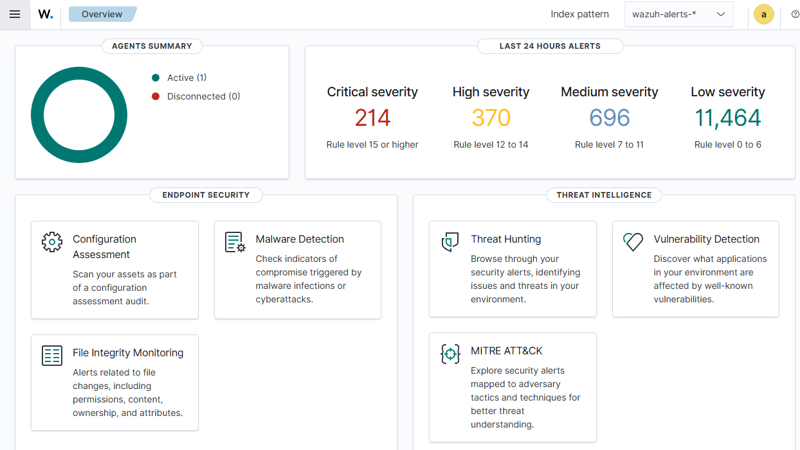
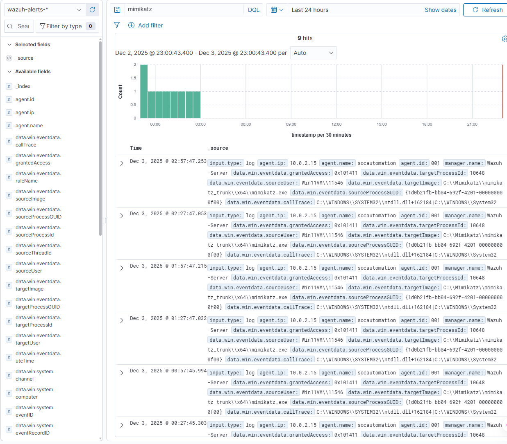
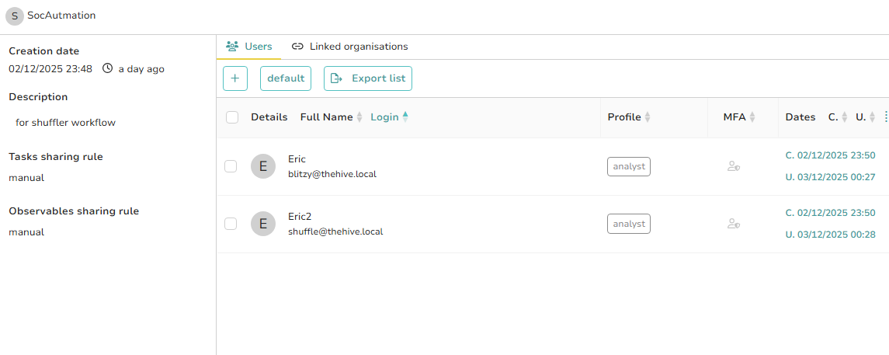
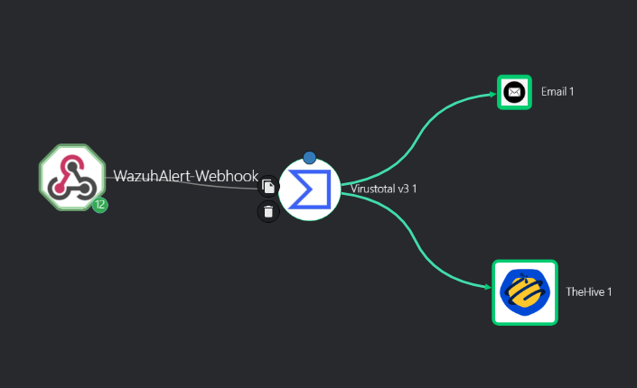
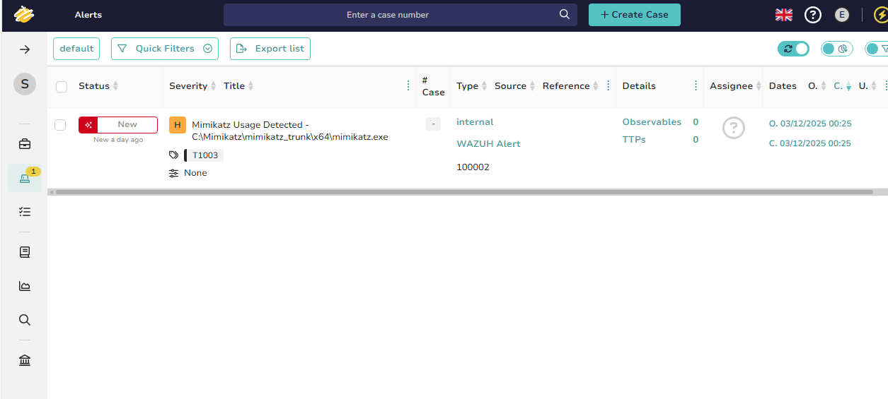
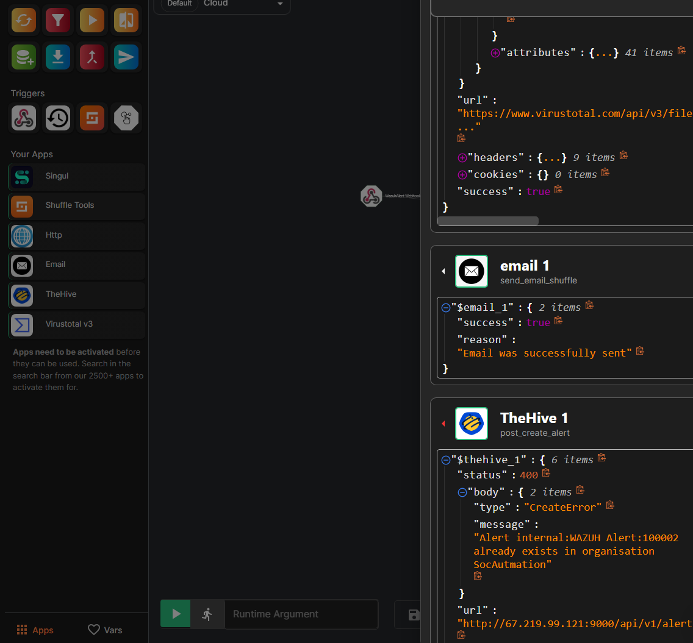

# Automated-Cloud-SOC-Homelab-1
End-to-end SOC automation lab featuring Wazuh SIEM, Shuffle SOAR, TheHive, and VirusTotal integration for threat detection and incident response

## Overview

This is a complete SOC automation lab that automatically detects threats, enriches alerts with threat intelligence, and creates incident tickets all without manual intervention.

When malicious software (like Mimikatz) runs on a Windows11 VM (an endpoint that has all security disabled for testing purposes), the system automatically:
1. Detects it within seconds
2. Looks up the file's reputation online
3. Sends an email alert
4. Creates a case for investigation

## Architecture

## Tools Used

**Wazuh** - SIEM platform that collects and analyzes security logs from my Windows machine

**Sysmon** - Windows system monitor that captures detailed telemetry (installed on Windows VM)

**Shuffle** - SOAR platform that automates the workflow between all tools

**VirusTotal** - Threat intelligence service that checks if detected files are known malware

**TheHive** - Case management platform that tracks security incidents

**VirtualBox & Vultr** - Virtualization (local Windows VM) and cloud infrastructure (Ubuntu servers)

## How It Works

Here's what happens when Mimikatz  runs on the Windows endpoint:

### Step 1: Detection
- Sysmon on Windows detects the suspicious process access
- Wazuh agent forwards the log to the SIEM server
- My custom detection rule triggers an alert

### Step 2: Enrichment
- Shuffle receives the alert via webhook
- Extracts the file hash from the alert
- Queries VirusTotal API for threat intelligence

### Step 3: Notification & Ticketing
- Automated email sent to SOC team with alert details
- Case automatically created in TheHive with:
  - Alert description and severity
  - VirusTotal results
  - MITRE ATT&CK technique tag
  - Host information

### Step 4: Response
- SOC analyst reviews the enriched alert
- Investigates scope and decides on remediation
- Documents actions in TheHive case

## Building This Lab Step by Step

This section walks through how I built this SOC automation lab from scratch.
Some configurations will be made available in the config folder.

### Phase 1: Setting Up the Infrastructure

**Creating the Windows 11 VM**

I started by setting up a Windows 11 virtual machine in VirtualBox to serve as my endpoint. Windows 11 has strict hardware requirements, so I used registry modifications to bypass the TPM and Secure Boot checks. Once the VM was running, I disabled Windows Defender completely since I needed to test malware detection without interference from built-in antivirus.

**Deploying Cloud Infrastructure**

For the SIEM and case management platforms, I chose Vultr for cloud hosting. I deployed two separate Ubuntu 22.04 servers:
- One for the Wazuh SIEM server
- One for TheHive case management platform

### Phase 2: Installing Sysmon

To get detailed telemetry from my Windows endpoint, I installed Sysmon using Olaf Hartong's configuration. This configuration is specifically designed for threat detection and provides comprehensive logging of process activity, network connections, and file operations.

After installation, I verified that Sysmon was generating events by checking Windows Event Viewer under Applications and Services Logs → Microsoft → Windows → Sysmon → Operational.

### Phase 3: Setting Up Wazuh SIEM

**Installing Wazuh Manager**

On my Vultr Ubuntu server, I installed the Wazuh Manager. The installation set up the main SIEM components including the analysis engine, API, and web dashboard.

**Configuring Firewall Rules**

I configured firewall rules to open the necessary ports for agent communication:
- Port 1514 (agent communication)
- Port 1515 (agent enrollment)  
- Port 55000 (API)

**Installing the Wazuh Agent**

On my Windows 11 VM, I installed the Wazuh agent and configured it to point to my Wazuh server's IP address.

**Configuring Log Archiving**

I modified the Wazuh configuration to enable comprehensive log archiving, ensuring all Sysmon events were being stored in the wazuh-archives index in addition to triggered alerts in wazuh-alerts.

### Phase 4: Creating Custom Detection Rules

I created a custom detection rule to detect Mimikatz execution. The rule monitors Sysmon Event ID 10 (Process Access) events and triggers when it detects the Mimikatz executable being accessed. I mapped this detection to MITRE ATT&CK technique.

After creating the rule in `/var/ossec/etc/rules/local_rules.xml` and restarting the Wazuh manager, I tested it by running Mimikatz on my Windows VM. The alert appeared successfully in the wazuh-alerts index.

### Phase 5: Deploying TheHive

**Installing TheHive Components**

TheHive requires multiple components working together:
- Cassandra (distributed database)
- Elasticsearch (search and indexing)
- TheHive application

I installed each component on my second Vultr server, following the proper installation order.

**Creating the Organization and Users**

Once TheHive was running, I created a new organization called "SocAutmation" for this project. Within this organization, I created two user accounts:

1. **blitzy@thehive.local** - An analyst account for human investigation
2. **shuffle@thehive.local** - A service account for API automation

Both accounts were given the analyst profile to create and manage alerts.

### Phase 6: Building the Shuffle Workflow

**Setting Up the Webhook**

I created an account on Shuffle.io and started building my automation workflow. The workflow begins with a webhook that receives alerts from Wazuh. I started the webhook to make it active and copied the generated webhook URL.

**Configuring Wazuh Integration**

I configured Wazuh to send alerts to Shuffle by adding an integration in `/var/ossec/etc/ossec.conf`. The integration specifies the Shuffle webhook URL, the rule ID to trigger on (100002), and JSON as the alert format.

After restarting the Wazuh manager and running Mimikatz again, I confirmed the webhook received the alert data in Shuffle's execution history.

### Phase 7: Adding VirusTotal Enrichment

**Configuring VirusTotal in Shuffle**

I added the VirusTotal action to query file hash reputations. 

When tested, VirusTotal returned results showing 64 out of 72 antivirus engines flagged the file as malicious.

### Phase 8: Integrating TheHive

**Generating an API Key**

I logged into TheHive as the shuffle@thehive.local service account and created an API key for Shuffle to use.

**Configuring TheHive in Shuffle**

I added the TheHive action to automatically create alerts. The action uses:
- TheHive server URL
- The API key for authentication
- Dynamic alert data pulled from the Wazuh webhook

The alert payload includes details from Wazuh, VirusTotal results, MITRE ATT&CK tags, severity levels, and host information.

### Phase 9: Adding Email Notifications

I added an email notification action to alert the SOC team when high-severity threats are detected. The email includes:
- Alert details from Wazuh
- VirusTotal detection count
- Link to the TheHive case
- Recommended response actions

### Phase 10: End-to-End Testing

With all components configured, I performed an end-to-end testing:

1. Executed Mimikatz on the Windows VM
2. Verified Wazuh rule triggered
3. Confirmed Shuffle workflow executed successfully
4. Validated VirusTotal returned threat intelligence
5. Checked email notification was sent
6. Verified TheHive alert was created with all enrichment data

**Total execution time: Less than 1 second from detection to case creation**

The complete detection and response workflow now runs automatically, transforming what would be a manual process into an instant, automated response.

*Built as a hands-on learning project to demonstrate practical SOC automation skills, credit to MyDFIR for providing project outline and guiudance*
